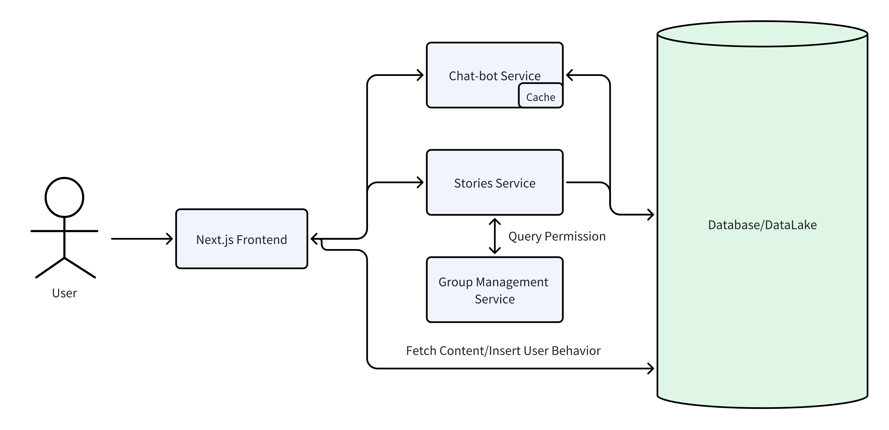

# Yuqi Guo's Portfolio Blog

This Next.js application showcases a dynamic portfolio with a contact form that emails submissions directly to your inbox, utilizing serverless functions for backend operations. It features project detail pages with parallax images and navigational links to browse through projects sequentially.

🌐: https://www.yuqi.site

## Structure



## Features

- Dynamic project pages with detailed information.
- Contact form integrated with serverless API to send messages via email.
- Navigation to the next project for seamless browsing experience.
- Utilize Supabase as the database backend, enabling users to seamlessly manage their "Works" or "Blogs" directly through the Supabase console.
- Parallax effect for project images.
- Datalake to record visitor's operations for analysis.

## Getting Started

To get a local copy up and running follow these simple steps.

### Prerequisites

- npm
  ```sh
  npm install npm@latest -g
  ```

### Installation
- Clone the repo
  ```sh
  git clone https://github.com/YuqiGuo105/Portfolio.git
  ```

- Install NPM packages
  ```sh
  npm install
  ```

- Start the development server (Next.js defaults to http://localhost:3000)
  ```sh
  npm run dev
  ```

- Open the site locally in your browser at `http://localhost:3000`

- Set up environment variables in '.env'
  ```
  NEXT_PUBLIC_SUPABASE_URL=YOUR_SUPABASE_URL
  NEXT_PUBLIC_SUPABASE_ANON_KEY=YOUR_SUPABASE_ANON_KEY
  EMAIL_USER=USER_EMAIL
  EMAIL_PASS=YOUR_PASS
  EMAIL_TO=TO_USER
  ```

### Supabase setup

1. **Create a project** at [app.supabase.com](https://app.supabase.com) and copy the **Project URL** and **anon (public) API key** from _Project Settings → API_. Paste them into `NEXT_PUBLIC_SUPABASE_URL` and `NEXT_PUBLIC_SUPABASE_ANON_KEY` in your `.env`.

2. **Apply the database schema and RLS policies.** Open the Supabase SQL editor and run the contents of `create_sql.txt` located at the root of this repository. This script creates all required tables (e.g., `visitor_logs`) and configures the necessary Row Level Security (RLS) policies.

3. **Deploy environment variables** to Vercel (or your hosting provider) so the serverless API routes can access Supabase in production.

## Usage
- Browse the project portfolio and use the contact form to send messages directly to the project owner's email.
- Utilize Supabase as database, so user can edit work/blog part.
- Integrate WYSIWYG to web content that user can easily editor "Blogs"/"Work" content.
- To open the chat widget automatically, use a URL with `?openChat=1` appended (`http://localhost:3000/?openChat=1`).

## SEO Improvements
This project includes basic search engine optimization features:
- Meta tags for titles and descriptions using a reusable `SeoHead` component.
- `robots.txt` and `sitemap.xml` are provided in the `public` folder for better crawling.
## Contributing
Contributions are what make the open-source community such an amazing place to learn, inspire, and create. Any contributions you make are greatly appreciated.

## License

MIT License

Copyright (c) 2024 Yuqi Guo

Permission is hereby granted, free of charge, to any person obtaining a copy
of this software and associated documentation files (the "Software"), to deal
in the Software without restriction, including without limitation the rights
to use, copy, modify, merge, publish, distribute, sublicense, and/or sell
copies of the Software, and to permit persons to whom the Software is
furnished to do so, subject to the following conditions:

The above copyright notice and this permission notice shall be included in all
copies or substantial portions of the Software.

THE SOFTWARE IS PROVIDED "AS IS", WITHOUT WARRANTY OF ANY KIND, EXPRESS OR
IMPLIED, INCLUDING BUT NOT LIMITED TO THE WARRANTIES OF MERCHANTABILITY,
FITNESS FOR A PARTICULAR PURPOSE AND NONINFRINGEMENT. IN NO EVENT SHALL THE
AUTHORS OR COPYRIGHT HOLDERS BE LIABLE FOR ANY CLAIM, DAMAGES OR OTHER
LIABILITY, WHETHER IN AN ACTION OF CONTRACT, TORT OR OTHERWISE, ARISING FROM,
OUT OF OR IN CONNECTION WITH THE SOFTWARE OR THE USE OR OTHER DEALINGS IN THE
SOFTWARE.
