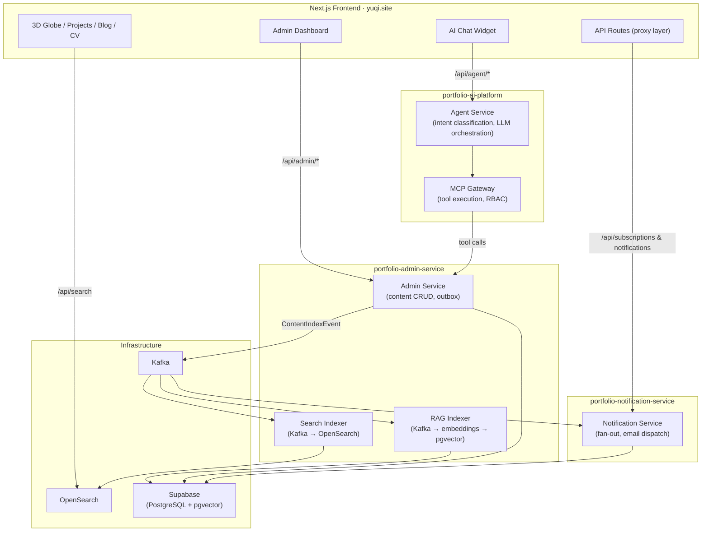

# Yuqi Guo's Portfolio Blog

This Next.js application showcases a dynamic portfolio with a contact form that emails submissions directly to your inbox, utilizing serverless functions for backend operations. It features project detail pages with parallax images and navigational links to browse through projects sequentially.

🌐: https://www.yuqi.site

## Architecture


```mermaid
flowchart TB
    subgraph Frontend["Next.js Frontend · yuqi.site"]
        UI["3D Globe / Projects / Blog / CV"]
        Chat["AI Chat Widget"]
        Admin["Admin Dashboard"]
        Proxy["API Routes (proxy layer)"]
    end

    subgraph AI["portfolio-ai-platform"]
        Agent["Agent Service\n(intent classification, LLM orchestration)"]
        MCP["MCP Gateway\n(tool execution, RBAC)"]
    end

    subgraph AdminPlatform["portfolio-admin-service"]
        AdminAPI["Admin Service\n(content CRUD, outbox)"]
        Search["Search Indexer\n(Kafka → OpenSearch)"]
        RAG["RAG Indexer\n(Kafka → embeddings → pgvector)"]
    end

    subgraph Notif["portfolio-notification-service"]
        NotifSvc["Notification Service\n(fan-out, email dispatch)"]
    end

    subgraph Infra["Infrastructure"]
        Kafka["Kafka"]
        OS["OpenSearch"]
        Supabase["Supabase\n(PostgreSQL + pgvector)"]
    end

    %% Frontend connections
    Chat -->|/api/agent/*| Agent
    Admin -->|/api/admin/*| AdminAPI
    Proxy -->|/api/subscriptions & notifications| NotifSvc
    UI -->|/api/search| OS

    %% AI platform
    Agent --> MCP
    MCP -->|tool calls| AdminAPI

    %% Admin publishes via Kafka
    AdminAPI -->|ContentIndexEvent| Kafka
    Kafka --> Search
    Kafka --> RAG
    Kafka --> NotifSvc

    %% Indexers write to stores
    Search --> OS
    RAG --> Supabase
    AdminAPI --> Supabase
    NotifSvc --> Supabase
```

## Features

- AI chat with RAG retrieval and multi-round deep-reasoning mode (MCP tool calls visible in UI).
- Admin dashboard for content CRUD with optimistic concurrency and publish-to-index pipeline.
- Kafka-driven fan-out: content changes propagate to search, RAG, and notification consumers.
- Subscription & notification system with email dispatch, proxied through Next.js API routes.
- 3D geospatial visitor globe, parallax project pages, and guided site tour.
- Supabase backend (PostgreSQL + pgvector) with RLS policies and real-time capabilities.

## Getting Started

To get a local copy up and running follow these simple steps.

### Prerequisites

- npm
  ```sh
  npm install npm@latest -g
  ```

### Installation
- Clone the repo
  ```sh
  git clone https://github.com/YuqiGuo105/Portfolio.git
  ```

- Install NPM packages
  ```sh
  npm install
  ```

- Start the development server (Next.js defaults to http://localhost:3000)
  ```sh
  npm run dev
  ```

- Open the site locally in your browser at `http://localhost:3000`

- Set up environment variables in '.env'
  ```
  NEXT_PUBLIC_SUPABASE_URL=YOUR_SUPABASE_URL
  NEXT_PUBLIC_SUPABASE_ANON_KEY=YOUR_SUPABASE_ANON_KEY
  SUPABASE_SERVICE_ROLE_KEY=YOUR_SERVICE_ROLE_KEY
  EMAIL_USER=USER_EMAIL
  EMAIL_PASS=YOUR_PASS
  EMAIL_TO=TO_USER
  ```

### Supabase setup

1. **Create a project** at [app.supabase.com](https://app.supabase.com) and copy the **Project URL** and **anon (public) API key** from _Project Settings → API_. Paste them into `NEXT_PUBLIC_SUPABASE_URL` and `NEXT_PUBLIC_SUPABASE_ANON_KEY` in your `.env`.

2. **Add the service role key.** From _Project Settings → API_, copy the **service_role** key and set it as `SUPABASE_SERVICE_ROLE_KEY` in your `.env` (and in Vercel environment variables). This key is used exclusively by server-side API routes and is never exposed to the browser.

3. **Apply the database schema and RLS policies.** Open the Supabase SQL editor and run the contents of `create_sql.txt` located at the root of this repository. This script creates all required tables (e.g., `visitor_logs`) and configures the necessary Row Level Security (RLS) policies.

4. **Deploy environment variables** to Vercel (or your hosting provider) so the serverless API routes can access Supabase in production.

## Usage
- Browse the project portfolio and use the contact form to send messages directly to the project owner's email.
- Utilize Supabase as database, so user can edit work/blog part.
- Integrate WYSIWYG to web content that user can easily editor "Blogs"/"Work" content.
- To open the chat widget automatically, use a URL with `?openChat=1` appended (`http://localhost:3000/?openChat=1`).

## SEO Improvements
This project includes basic search engine optimization features:
- Meta tags for titles and descriptions using a reusable `SeoHead` component.
- `robots.txt` and `sitemap.xml` are provided in the `public` folder for better crawling.
## Contributing
Contributions are what make the open-source community such an amazing place to learn, inspire, and create. Any contributions you make are greatly appreciated.

## License
Distributed under the MIT License. See LICENSE for more information.
