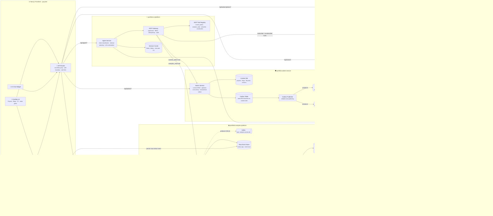

# Yuqi Guo's Portfolio Blog

A modern Next.js portfolio application for showcasing projects, blogs, CV, visitor analytics, and an AI-powered portfolio assistant. The site is designed as both a personal portfolio and a microservice-backed engineering platform, with serverless frontend APIs, Supabase-backed content storage, Kafka-based event fan-out, OpenSearch search, pgvector RAG indexing, notification delivery, and a real-time visitor analytics pipeline.

🌐 Production: https://www.yuqi.site

---

## Architecture

The diagram is grouped by **service boundary** and shows **explicit producer → Kafka topic → consumer** relationships. Data is modeled as **service-owned logical stores**; at smaller scale some of these may start in the same Postgres cluster or schema, then split into separate databases as throughput, ownership, and isolation needs grow.


```mermaid
%%{init: {"flowchart": {"nodeSpacing": 90, "rankSpacing": 120, "curve": "basis", "htmlLabels": true}, "diagramPadding": 24, "themeVariables": {"fontSize": "18px"}}}%%
flowchart LR

    %% =========================
    %% Frontend
    %% =========================
    subgraph FE["🌐 Next.js Frontend · yuqi.site"]
        direction TB
        UI["🧭 Portfolio UI<br/><small>Projects · Blogs · CV · visitor globe</small>"]
        Chat["💬 AI Chat Widget"]
        AdminDash["🛠️ Admin Dashboard"]
        Proxy["🔀 API Routes<br/><small>serverless proxy · auth boundary · rate limits</small>"]
        Track["📡 Analytics Tracking API<br/><small>/api/tracking · Kafka producer · UUIDv7 eventId</small>"]

        UI --> Proxy
        UI -->|"page_view / click beacon"| Track
        Chat --> Proxy
        AdminDash --> Proxy
    end

    %% =========================
    %% AI Platform
    %% =========================
    subgraph AI["🤖 portfolio-ai-platform"]
        direction TB
        Agent["Agent Service<br/><small>intent classification · retrieval planning · LLM orchestration</small>"]
        MCP["MCP Gateway<br/><small>typed tools · RBAC · idempotency · audit</small>"]
        ToolRegistry["MCP Tool Registry<br/><small>content_admin · analytics_read · subscribe · unsubscribe</small>"]
        SessionCache[("Session Cache<br/><small>Redis / Valkey · chat state · TTL</small>")]

        Agent --> MCP
        MCP --> ToolRegistry
        Agent --> SessionCache
    end

    %% =========================
    %% Admin Platform
    %% =========================
    subgraph ADMIN["🛡️ portfolio-admin-service"]
        direction TB
        AdminAPI["Admin Service<br/><small>content CRUD · optimistic concurrency · transactional outbox</small>"]
        ContentDB[("Content DB<br/><small>projects · blogs · life posts · versions</small>")]
        Outbox[("Outbox Table<br/><small>same DB transaction as content write</small>")]
        OutboxPub["Outbox Publisher<br/><small>reliable event publishing</small>"]
        KContent@{ shape: h-cyl, label: "Kafka<br/><small>topic: content.index.events</small>" }
        KDispatch@{ shape: h-cyl, label: "Kafka<br/><small>topic: notification.dispatch.events</small>" }
        SearchIndexer["Search Indexer<br/><small>consumer · OpenSearch projection</small>"]
        RAGIndexer["RAG Indexer<br/><small>consumer · chunking · embeddings</small>"]

        AdminAPI --> ContentDB
        AdminAPI --> Outbox
        Outbox --> OutboxPub
        OutboxPub -->|"producer"| KContent
        OutboxPub -->|"producer"| KDispatch
    end

    %% =========================
    %% Notification Platform
    %% =========================
    subgraph NOTIF["🔔 portfolio-notification-service"]
        direction TB
        NotifAPI["Subscription / Notification API<br/><small>subscribe · unsubscribe · preferences</small>"]
        SubscriptionDB[("Subscription DB<br/><small>subscribers · preferences · topic membership</small>")]
        Dispatch["Dispatch Service<br/><small>consumer · fan-out · batching · dedupe</small>"]
        DeliveryDB[("Delivery DB<br/><small>delivery rows · status · retries · audit</small>")]
        KEmail@{ shape: h-cyl, label: "Kafka<br/><small>topic: notification.email.send</small>" }
        EmailWorker["Email Sender Worker<br/><small>consumer · retry · backoff · provider adapter</small>"]

        NotifAPI --> SubscriptionDB
        KDispatch -->|"consumer"| Dispatch
        Dispatch --> SubscriptionDB
        Dispatch --> DeliveryDB
        Dispatch -->|"producer"| KEmail
    end

    %% =========================
    %% Analytics Platform
    %% =========================
    subgraph ANALYTICS["📊 portfolio-analytics-platform"]
        direction TB
        VisitsAPI["Public Visits API<br/><small>/summary · /markers · /markers/area</small>"]
        KRaw@{ shape: h-cyl, label: "Kafka<br/><small>topic: analytics.raw.events</small>" }
        KDLQ@{ shape: h-cyl, label: "Kafka<br/><small>topic: analytics.events.dlq</small>" }
        Aggregator["Aggregator Service<br/><small>consumer · dedup · UA/IP/Geo enrichment · 5m/1d rollups</small>"]
        RawEventDB[("Raw Event Store<br/><small>visitor_logs · event trace</small>")]
        RollupDB[("Rollup DB<br/><small>geo_time_rollups · aggregated read model</small>")]
        DedupCache[("Dedup Cache<br/><small>Redis / Valkey · SETNX eventId · TTL</small>")]
        AlertRulesDB[("Alert Rules DB<br/><small>thresholds · SLOs · cooldown policy</small>")]
        IncidentDB[("Incident DB<br/><small>alert_incidents · alert_audit_log</small>")]
        AlertEvaluator["Alert Evaluator<br/><small>rule evaluation · noise reduction · email alerts</small>"]

        KRaw -->|"consumer"| Aggregator
        Aggregator --> RawEventDB
        Aggregator --> DedupCache
        Aggregator --> RollupDB
        Aggregator -.->|"producer (DLQ)"| KDLQ
        VisitsAPI --> RollupDB
        RollupDB --> AlertEvaluator
        AlertRulesDB --> AlertEvaluator
        AlertEvaluator --> IncidentDB
    end

    %% =========================
    %% Shared Search / Vector / Email Infra
    %% =========================
    subgraph INFRA["🗄️ Shared Search / Vector / Delivery Infrastructure"]
        direction TB
        OpenSearch[("OpenSearch<br/><small>search read model · ranking</small>")]
        VectorDB[("Vector DB<br/><small>pgvector / embeddings / retrieval chunks</small>")]
        EmailProvider["📧 Email Provider<br/><small>SMTP · SendGrid · SES</small>"]
    end

    %% =========================
    %% Frontend to services
    %% =========================
    Proxy -->|"/api/agent/*"| Agent
    Proxy -->|"/api/admin/*"| AdminAPI
    Proxy -->|"/api/subscriptions/*"| NotifAPI
    Proxy -->|"/api/analytics/visits/*"| VisitsAPI
    Proxy -->|"/api/search"| OpenSearch
    MCP -->|"content_admin tool"| AdminAPI
    MCP -->|"analytics_read tool"| VisitsAPI
    MCP -->|"subscribe / unsubscribe tools"| NotifAPI

    %% =========================
    %% Analytics producer path
    %% =========================
    Track -->|"producer: RawAnalyticsEvent"| KRaw
    Track -->|"persist raw visitor event"| RawEventDB

    %% =========================
    %% Consumers to data / providers
    %% =========================
    KContent -->|"consumer"| SearchIndexer
    KContent -->|"consumer"| RAGIndexer
    SearchIndexer --> OpenSearch
    RAGIndexer --> VectorDB
    Agent --> VectorDB

    KEmail -->|"consumer"| EmailWorker
    EmailWorker --> EmailProvider
    EmailWorker --> DeliveryDB

    AlertEvaluator --> EmailProvider
```

Key properties:

* **Explicit event contracts.** Every Kafka path is modeled as **producer → topic → consumer**. For analytics, the frontend sends page-view / click beacons to `/api/tracking`, and that API route produces `RawAnalyticsEvent` messages into `analytics.raw.events` for the Aggregator consumer.
* **MCP as a governed tool layer.** The Agent does not bypass service APIs. MCP exposes typed tools for `content_admin`, `analytics_read`, `subscribe`, and `unsubscribe`, then routes them through the owning services with RBAC, idempotency, and audit.
* **Service-owned data domains.** Content, subscriptions, deliveries, raw events, rollups, alert rules, and incidents are shown as separate logical stores. This is a staff-level boundary model: you can begin with shared infrastructure, but evolve toward stronger isolation by workload and ownership.
* **Transactional publishing for content changes.** `portfolio-admin-service` writes content and outbox rows in one transaction, then publishes asynchronously to indexing and notification topics.
* **Separate operational and analytical stores.** Analytics keeps raw event trace, rollup read models, dedup cache, alert rules, and incident state distinct so query patterns, retention, and scaling can evolve independently.
* **Read-model separation.** OpenSearch serves user-facing search, Vector DB serves RAG retrieval, and domain databases remain the system of record for writes and operational state.
* **Built-in alerting.** `portfolio-analytics-platform` evaluates rules from `Alert Rules DB`, persists incident state, suppresses noise, and sends rule-based email alerts.

---

## Microservices GitHub Repositories

| Service                            | Repository                                                                                                | Responsibility                                                                                                |
| ---------------------------------- | --------------------------------------------------------------------------------------------------------- | ------------------------------------------------------------------------------------------------------------- |
| **Portfolio Frontend**             | [YuqiGuo105/Portfolio](https://github.com/YuqiGuo105/Portfolio)                                           | Next.js frontend, project pages, blogs, API proxy routes, chat widget, visitor globe                          |
| **portfolio-ai-platform**          | [YuqiGuo105/portfolio-ai-platform](https://github.com/YuqiGuo105/portfolio-ai-platform)                   | Agent service, intent classification, LLM orchestration, MCP gateway, typed tools for content admin, analytics read, subscribe/unsubscribe, RBAC, idempotency, audit |
| **portfolio-admin-service**        | [YuqiGuo105/portfolio-admin-service](https://github.com/YuqiGuo105/portfolio-admin-service)               | Content CRUD, optimistic concurrency, transactional outbox, Kafka publishing, OpenSearch indexer, RAG indexer |
| **portfolio-notification-service** | [YuqiGuo105/portfolio-notification-service](https://github.com/YuqiGuo105/portfolio-notification-service) | Subscription APIs, notification dispatch, email sender worker, retry handling, delivery tracking              |
| **portfolio-analytics-platform**   | [YuqiGuo105/portfolio-analytics-platform](https://github.com/YuqiGuo105/portfolio-analytics-platform)     | Spring Boot Kafka batch consumer, UA/IP/geo enrichment, Valkey dedup, pre-aggregated 5m + 1d rollups, public visits API, rule-based alert evaluator, email alerting |

---

## Features

* **Modern portfolio frontend** built with Next.js, including projects, blogs, CV, parallax project detail pages, and guided navigation.
* **AI chat assistant** with RAG retrieval, multi-round reasoning, intent classification, and MCP tool execution for content/admin actions, analytics reads, subscribe, and unsubscribe.
* **Admin dashboard** for managing blogs, projects, life posts, and portfolio content.
* **Kafka-driven content pipeline** that publishes content change events to search, RAG, and notification consumers.
* **Professional search stack** using OpenSearch for indexed portfolio search and ranking.
* **RAG indexing pipeline** using embeddings stored in Supabase PostgreSQL with pgvector.
* **Notification system** with subscription management, dispatch service, email sender worker, retry handling, and delivery tracking.
* **Supabase backend** for PostgreSQL, pgvector, storage, RLS policies, and server-side API integration.
* **3D geospatial visitor globe** and a real-time `/analytics` dashboard powered by a Kafka → Spring Boot aggregator pipeline (Valkey dedup, pre-aggregated `geo_time_rollups`, public visits API, rule-based email alerts).
* **SEO support** with reusable metadata, `robots.txt`, and `sitemap.xml`.

---

## Getting Started

Follow these steps to run the frontend locally.

### Prerequisites

* Node.js
* npm

Install the latest npm globally if needed:

```sh
npm install npm@latest -g
```

### Installation

Clone the repository:

```sh
git clone https://github.com/YuqiGuo105/Portfolio.git
cd Portfolio
```

Install dependencies:

```sh
npm install
```

Start the local development server:

```sh
npm run dev
```

Open the application at:

```txt
http://localhost:3000
```

To open the chat widget automatically, append `?openChat=1`:

```txt
http://localhost:3000/?openChat=1
```

---

## Environment Variables

Copy `.env.example` to `.env.local` and fill in your values:

```sh
cp .env.example .env.local
```

See [`.env.example`](.env.example) for all variables with descriptions. For production, configure the same variables in **Vercel → Project Settings → Environment Variables**.

---

## Supabase Setup

1. Create a Supabase project at [app.supabase.com](https://app.supabase.com).
2. Copy the Project URL and anon public API key from **Project Settings → API**.
3. Add them to `.env` as `NEXT_PUBLIC_SUPABASE_URL` and `NEXT_PUBLIC_SUPABASE_ANON_KEY`.
4. Copy the `service_role` key and set it as `SUPABASE_SERVICE_ROLE_KEY`.
5. Open the Supabase SQL Editor.
6. Run the schema and RLS policy script from `create_sql.txt` in the repository root.
7. Confirm that required tables, policies, and server-side access patterns are configured correctly.

---

## Usage

* Browse projects, blogs, and portfolio details.
* Use the contact form to send messages to the portfolio owner.
* Use the AI chat widget to ask questions about the portfolio.
* Use the Admin Dashboard to edit portfolio content.
* Use Supabase as the source of truth for editable content.
* Use OpenSearch for fast search experiences.
* Use Kafka consumers to keep search, RAG, and notifications in sync.

---

## SEO

This project includes basic SEO support:

* Reusable SEO metadata component
* Page-level titles and descriptions
* `robots.txt`
* `sitemap.xml`
* Production site URL configuration

---

## Contributing

Contributions are welcome. To contribute:

1. Fork the repository.
2. Create a feature branch.
3. Commit your changes.
4. Open a pull request with a clear description of the change.

---

## License

MIT License

Copyright (c) 2023 Yuqi Guo

Permission is hereby granted, free of charge, to any person obtaining a copy
of this software and associated documentation files (the "Software"), to deal
in the Software without restriction, including without limitation the rights
to use, copy, modify, merge, publish, distribute, sublicense, and/or sell
copies of the Software, and to permit persons to whom the Software is
furnished to do so, subject to the following conditions:

The above copyright notice and this permission notice shall be included in all
copies or substantial portions of the Software.

THE SOFTWARE IS PROVIDED "AS IS", WITHOUT WARRANTY OF ANY KIND, EXPRESS OR
IMPLIED, INCLUDING BUT NOT LIMITED TO THE WARRANTIES OF MERCHANTABILITY,
FITNESS FOR A PARTICULAR PURPOSE AND NONINFRINGEMENT. IN NO EVENT SHALL THE
AUTHORS OR COPYRIGHT HOLDERS BE LIABLE FOR ANY CLAIM, DAMAGES OR OTHER
LIABILITY, WHETHER IN AN ACTION OF CONTRACT, TORT OR OTHERWISE, ARISING FROM,
OUT OF OR IN CONNECTION WITH THE SOFTWARE OR THE USE OR OTHER DEALINGS IN THE
SOFTWARE.
