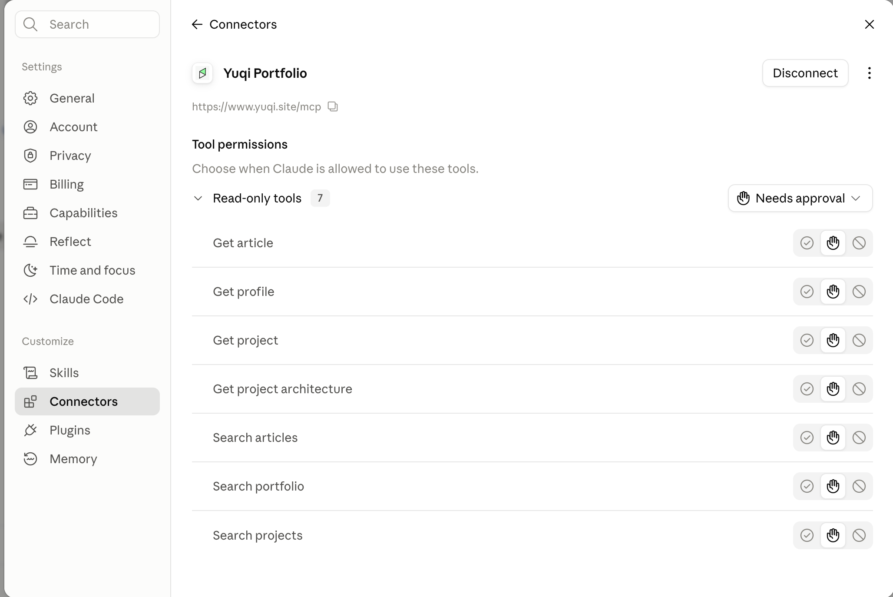
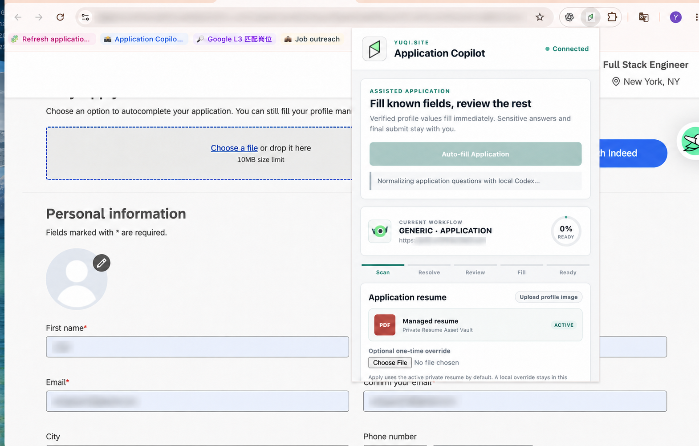

# Yuqi Guo's Portfolio Platform

[](LICENSE)

A modern Next.js portfolio application for showcasing projects, blogs, CV, visitor analytics, and an AI-powered portfolio assistant. The site is designed as both a personal portfolio and a microservice-backed engineering platform, with serverless frontend APIs, Supabase-backed content storage, Kafka-based event fan-out, OpenSearch search, pgvector RAG indexing, notification delivery, and a real-time visitor analytics pipeline.

**Production:** https://www.yuqi.site

---

## Architecture

<p align="center">
  
</p>

> **Maintain this diagram:** edit [`docs/architecture/platform-system-flow.json`](docs/architecture/platform-system-flow.json), then run `node scripts/render-architecture-diagram.mjs docs/architecture/platform-system-flow.json`.

---

## MCP Integrations

Connect Claude, Codex, or any Streamable HTTP MCP client to the public endpoint
at `https://www.yuqi.site/mcp`. The connector exposes seven read-only tools for
searching portfolio content and retrieving articles, projects, architecture,
and professional profile evidence.

**Admin MCP requires sign-in with an authorized administrator account.** Connect
to `https://www.yuqi.site/mcp/admin` and complete the sign-in and consent flow.
Authentication alone does not grant admin access: permissions are enforced by
server-managed roles. The public endpoint above remains available without sign-in.

<table align="center">
  <tr>
    <th align="center">Public MCP · Read-only</th>
    <th align="center">Admin MCP · Sign-in required</th>
  </tr>
  <tr>
    <td align="center" valign="top" width="50%">
      <a href="docs/readme-assets/claude-yuqi-portfolio-connector.png">
        
      </a>
    </td>
    <td align="center" valign="top" width="50%">
      <a href="docs/readme-assets/claude-yuqi-portfolio-admin-connector.png">
        
      </a>
    </td>
  </tr>
</table>

**[Read the illustrated MCP connection guide →](https://www.yuqi.site/mcp-guide)**

The guide covers client setup, the seven public tools, example questions, and
the administrator sign-in and consent flow, with screenshots of the interfaces.

### Connect from Claude or Codex

In Claude, open **Settings → Customize → Connectors**, add a custom connector,
and use `https://www.yuqi.site/mcp` as the remote MCP server URL.

Open **+ → Plugins**, select **Yuqi Portfolio**, and ask Codex to use its tools.
For direct MCP setup:

```sh
codex mcp add yuqi-portfolio --url https://www.yuqi.site/mcp
codex mcp add yuqi-portfolio-admin --url https://www.yuqi.site/mcp/admin
```

The admin endpoint remains separately protected by sign-in, server-managed
roles, audited execution, and explicit confirmation for write operations.

<p align="center">
  <a href="public/assets/images/codex-yuqi-portfolio-plugin-v2.png">
    
  </a>
</p>

---

## Chrome Extension: Application Copilot

Application Copilot is a Chrome Manifest V3 extension that runs directly on job
application pages. Select **Auto-fill Application**, review the resolved fields,
and apply the approved values. Resume attachment is automatic; final submission
remains manual.

<p align="center">
  <a href="https://chromewebstore.google.com/detail/yuqi-application-copilot/kgebalpnomjfemfeeiaphpaomkkccebd">
    
  </a>
</p>

**[Install Application Copilot from the Chrome Web Store →](https://chromewebstore.google.com/detail/yuqi-application-copilot/kgebalpnomjfemfeeiaphpaomkkccebd)**<br>
[View source code](https://github.com/YuqiGuo105/portfolio-application-copilot)

---

## Microservices GitHub Repositories

| Service                            | Repository                                                                                                | Responsibility                                                                                                |
| ---------------------------------- | --------------------------------------------------------------------------------------------------------- | ------------------------------------------------------------------------------------------------------------- |
| **Portfolio Frontend**             | [YuqiGuo105/Portfolio](https://github.com/YuqiGuo105/Portfolio)                                           | Next.js frontend, project pages, blogs, API proxy routes, chat widget, visitor globe                          |
| **Public Portfolio MCP Server**    | [YuqiGuo105/portfolio-mcp-server](https://github.com/YuqiGuo105/portfolio-mcp-server)                     | Public, read-only Streamable HTTP MCP tools for projects, articles, architecture diagrams, and profile data   |
| **portfolio-ai-platform**          | [YuqiGuo105/portfolio-ai-platform](https://github.com/YuqiGuo105/portfolio-ai-platform)                   | Agent service (safety → retrieval → generation pipeline, event observability), knowledge service (hybrid BM25+kNN, RRF, OpenAI embed), MCP gateway (typed tools, RBAC, idempotency, audit) |
| **portfolio-admin-service**        | [YuqiGuo105/portfolio-admin-service](https://github.com/YuqiGuo105/portfolio-admin-service)               | Content CRUD, optimistic concurrency, transactional outbox, Kafka publishing, OpenSearch indexer, RAG indexer |
| **portfolio-notification-service** | [YuqiGuo105/portfolio-notification-service](https://github.com/YuqiGuo105/portfolio-notification-service) | Subscription APIs, notification dispatch, email sender worker, retry handling, delivery tracking              |
| **portfolio-analytics-platform**   | [YuqiGuo105/portfolio-analytics-platform](https://github.com/YuqiGuo105/portfolio-analytics-platform)     | Spring Boot Kafka batch consumer, UA/IP/geo enrichment, Valkey dedup, pre-aggregated 5m + 1d rollups, public visits API, alerts service |
| **portfolio-application-copilot**  | [YuqiGuo105/portfolio-application-copilot](https://github.com/YuqiGuo105/portfolio-application-copilot)   | Chrome MV3 assisted application UI, MCP career workflow, encrypted application memory, and private resume vault |

---

## Features

* **Modern portfolio frontend** built with Next.js, including projects, blogs, CV, parallax project detail pages, and guided navigation.
* **AI chat assistant** with RAG retrieval, multi-round reasoning, intent classification, and MCP tool execution.
* **Public MCP integration** that gives ChatGPT, Claude, GitHub Copilot, Cursor, and other MCP clients read-only access to projects, articles, stored architecture diagrams, and public profile data.
* **Application Copilot** that combines an authenticated Chrome extension, MCP workflow, deterministic field resolution, private resume assets, and explicit review before any sensitive field is applied.
* **Admin dashboard** for managing blogs, projects, life posts, and portfolio content.
* **Kafka-driven content pipeline** that publishes content change events to search, RAG, and notification consumers.
* **Professional search stack** using OpenSearch for indexed portfolio search and ranking.
* **RAG indexing pipeline** using embeddings stored in Supabase PostgreSQL with pgvector.
* **Notification system** with subscription management, dispatch service, email sender worker, retry handling, and delivery tracking.
* **Supabase backend** for PostgreSQL, pgvector, storage, RLS policies, and server-side API integration.
* **3D geospatial visitor globe** and a real-time `/analytics` dashboard powered by a Kafka → Spring Boot aggregator pipeline (Valkey dedup, pre-aggregated `geo_time_rollups`, public visits API).
* **SEO support** with reusable metadata, `robots.txt`, and `sitemap.xml`.

---

## Getting Started

Follow these steps to run the frontend locally.

### Prerequisites

* Node.js
* npm

Install the latest npm globally if needed:

```sh
npm install npm@latest -g
```

### Installation

Clone the repository:

```sh
git clone https://github.com/YuqiGuo105/Portfolio.git
cd Portfolio
```

Install dependencies:

```sh
npm install
```

Start the local development server:

```sh
npm run dev
```

Open the application at:

```txt
http://localhost:3000
```

To open the chat widget automatically, append `?openChat=1`:

```txt
http://localhost:3000/?openChat=1
```

---

## Environment Variables

Copy `.env.example` to `.env.local` and fill in your values:

```sh
cp .env.example .env.local
```

See [`.env.example`](.env.example) for all variables with descriptions. For production, configure the same variables in **Vercel → Project Settings → Environment Variables**.

---

## Supabase Setup

1. Create a Supabase project at [app.supabase.com](https://app.supabase.com).
2. Copy the Project URL and anon public API key from **Project Settings → API**.
3. Add them to `.env` as `NEXT_PUBLIC_SUPABASE_URL` and `NEXT_PUBLIC_SUPABASE_ANON_KEY`.
4. Copy the `service_role` key and set it as `SUPABASE_SERVICE_ROLE_KEY`.
5. Open the Supabase SQL Editor.
6. Run the schema and RLS policy script from `create_sql.txt` in the repository root.
7. Confirm that required tables, policies, and server-side access patterns are configured correctly.

---

## Usage

* Browse projects, blogs, and portfolio details.
* Use the contact form to send messages to the portfolio owner.
* Use the AI chat widget to ask questions about the portfolio.
* Use the Admin Dashboard to edit portfolio content.
* Use Supabase as the source of truth for editable content.
* Use OpenSearch for fast search experiences.
* Use Kafka consumers to keep search, RAG, and notifications in sync.

---

## SEO

This project includes basic SEO support:

* Reusable SEO metadata component
* Page-level titles and descriptions
* `robots.txt`
* `sitemap.xml`
* Production site URL configuration

---

## Contributing

Contributions are welcome. To contribute:

1. Fork the repository.
2. Create a feature branch.
3. Commit your changes.
4. Open a pull request with a clear description of the change.

---

## License

This project is available under the [MIT License](LICENSE).

Copyright (c) 2023-present Yuqi Guo.
