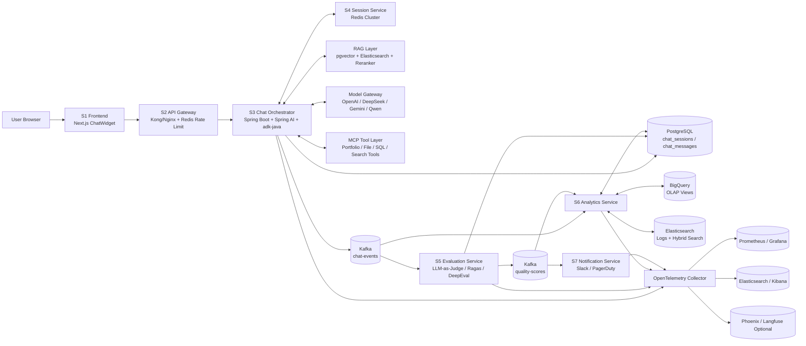
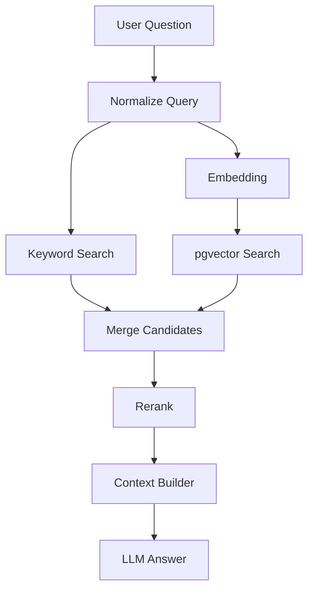

# Chat Agent Architecture：面向最新 AI Framework 的高层设计

> Repository: `YuqiGuo105/Portfolio`  
> Branch: `docs/ai-chat-agent-architecture`  
> Scope: Portfolio ChatWidget、RAG、Agent Orchestration、Telemetry、Evaluation、Analytics

---

## 0. 设计定位

当前 Portfolio 是一个 Next.js / React 前端项目，已经具备 ChatWidget、SSE streaming、Supabase、Markdown/LaTeX 渲染等基础能力。下一阶段不建议把它只做成“一个聊天窗口”，而是升级成一个完整的 **AI Chat Agent Platform**。

核心方向：

- 前端保持轻量：负责 ChatWidget UI、SSE/stream 消费、文件上传、页面上下文提取、telemetry 上报；
- 后端负责智能编排：Spring Boot + Spring AI + adk-java Runner + MCP tool layer；
- 异步链路负责质量闭环：Kafka → Evaluation → Analytics → Notification；
- 数据层分离：Redis 管 session，PostgreSQL 管 OLTP，BigQuery/Elasticsearch 管分析与搜索；
- AI Framework 不锁死：通过 Adapter / MCP / Queue Worker 支持 Spring AI、adk-java、Vercel AI SDK、LangGraph、AutoGen、CrewAI、LlamaIndex、LangChain/LangSmith、Ragas/DeepEval 等生态。

> 说明：具体框架版本应在实现时重新确认。本设计重点是让系统能持续接入新的 AI framework，而不是绑定某个固定版本。

---

## 1. 高层架构总览

整体架构采用 **7 个微服务 + 3 个基础设施组件 + AI Framework Adapter Layer**。

### 1.1 服务划分

| 编号 | 服务 | 推荐技术 | 核心职责 |
|---|---|---|---|
| S1 | Frontend Service | Next.js 12 / React 18 / Vercel AI SDK-compatible client | ChatWidget、SSE 消费、上传文件、页面上下文、telemetry |
| S2 | API Gateway | Kong / Nginx / Redis Rate Limiter | 统一入口、限流、SSE 长连接负载均衡、trace header 注入 |
| S3 | Chat Orchestrator Service | Spring Boot + Spring AI + adk-java Runner | 对话主链路、Agent runtime、plugin chain、RAG、model routing |
| S4 | Session Service | Redis Cluster + ADK BaseSessionService | 替换 InMemorySessionService，保存分布式 session/state |
| S5 | Evaluation Service | Spring Boot / Python Worker + LLM-as-Judge + Ragas/DeepEval optional | 异步质量评分、事实性检测、样本标注 |
| S6 | Analytics Service | Spring Boot + PostgreSQL + BigQuery + Elasticsearch | Dashboard API、质量趋势、RAG 命中率、延迟分析 |
| S7 | Notification Service | Slack / PagerDuty / Webhook | 质量下降、错误率上升、延迟超阈值告警 |

### 1.2 基础设施组件

| 编号 | 组件 | 用途 |
|---|---|---|
| I1 | Kafka / Redpanda | 事件总线：`chat-events`、`quality-scores`、`chat-errors` |
| I2 | PostgreSQL + pgvector | OLTP 主存储、chat history、quality scores、向量检索 |
| I3 | OpenTelemetry Collector | Trace / Metrics / Logs 汇聚到 Kibana、Grafana、Phoenix/Langfuse 可选 |

### 1.3 AI Framework Adapter Layer

| 层 | 可接入框架 | 设计作用 |
|---|---|---|
| Frontend Streaming | Vercel AI SDK / custom SSE | 统一前端 streaming contract，兼容现有 ChatWidget |
| Java Agent Runtime | adk-java / Spring AI / LangChain4j optional | 主生产链路，稳定运行在 Spring Boot 微服务中 |
| Tool Protocol | MCP | 工具统一协议，避免每个 agent framework 重写工具集成 |
| Graph Agent Worker | LangGraph / Semantic Kernel optional | 复杂多步任务、状态图、可恢复 workflow |
| Multi-Agent Worker | AutoGen / CrewAI optional | 研究型、多角色协作型任务，异步运行 |
| RAG / Indexing | LlamaIndex / LangChain / Spring AI VectorStore | 文档解析、chunking、embedding、retrieval、rerank |
| Evaluation | Ragas / DeepEval / LangSmith / custom judge | 自动质量评估、回归测试、prompt 改进闭环 |
| Model Gateway | LiteLLM / provider adapter | 统一 OpenAI、Anthropic、Gemini、DeepSeek、Qwen 等模型调用 |

---

## 2. 高层架构图



---

## 3. 当前 Portfolio 前端改造范围

### 3.1 当前前端保留能力

保留现有 ChatWidget 的核心能力：

- POST SSE streaming；
- `answer_delta` / `answer_final` 流式渲染；
- Markdown、代码块、LaTeX 渲染；
- 文件上传到 Supabase Storage；
- 页面上下文提取；
- localStorage 短期会话恢复；
- draggable / minimized ChatWidget UI。

### 3.2 需要调整的方向

当前前端不应该继续作为最终数据事实源。建议改成：

| 当前模式 | 目标模式 |
|---|---|
| 前端同步写 Supabase Chat 表 | 后端 S3 统一写 PostgreSQL |
| 前端 `console.log` logger | `chatTelemetryClient` 结构化事件 |
| ChatWidget 自己决定存储字段 | 后端统一 ChatEvent / DB schema |
| localStorage 作为聊天历史恢复 | localStorage 只做 UI 缓存，真实历史从后端拉取 |

### 3.3 新增前端 Telemetry SDK

建议新增：

```text
src/lib/telemetry/chatTelemetryClient.js
```

核心 API：

```ts
chatTelemetry.track("message_submitted", {
  traceId,
  sessionId,
  messageId,
  mode,
  pageUrl,
  fileCount,
});

chatTelemetry.track("answer_final_received", {
  traceId,
  sessionId,
  messageId,
  latencyMs,
  answerLength,
});

chatTelemetry.error("client_error", {
  traceId,
  sessionId,
  errorCode,
  message,
});
```

### 3.4 前端请求 Contract

```json
{
  "traceId": "trace-uuid",
  "sessionId": "session-uuid",
  "messageId": "message-uuid",
  "clientEventId": "client-event-uuid",
  "question": "用户问题",
  "mode": "FAST",
  "pageContext": {
    "url": "https://www.yuqi.site/...",
    "pagePattern": "/work-single/[id]",
    "pageTitle": "Project Page",
    "text": "compressed page context"
  },
  "fileUrls": ["https://..."],
  "frontend": {
    "framework": "nextjs",
    "streamProtocol": "sse",
    "client": "chat-widget"
  }
}
```

---

## 4. S3 Chat Orchestrator：AI Framework 集成核心

S3 是系统最重要的服务，建议作为单独 Spring Boot 服务：

```text
services/chat-orchestrator-service
```

### 4.1 推荐技术组合

| 能力 | 推荐主线 | 可选扩展 |
|---|---|---|
| Agent Runtime | adk-java Runner | LangGraph Worker / AutoGen Worker |
| Java AI Abstraction | Spring AI | LangChain4j |
| Tool Calling | MCP Client + internal tool registry | OpenAI tool calling / provider-native tools |
| Model Routing | Model Gateway Adapter | LiteLLM / custom provider router |
| RAG | Spring AI VectorStore + pgvector + Elasticsearch | LlamaIndex ingestion worker |
| Telemetry | OpenTelemetry | OpenInference / Phoenix / Langfuse |

### 4.2 为什么以 Spring Boot + adk-java 为主线

原因：

1. 你的主栈是 Java / Spring Boot，和简历方向一致；
2. adk-java 的 Runner / Session / Plugin 结构适合作为 Agent runtime；
3. Spring AI 更适合在 Java 微服务中统一接入 ChatModel、EmbeddingModel、VectorStore、Advisor；
4. Python/JS 的最新 agent framework 变化很快，不建议直接耦合在主请求链路；
5. LangGraph / AutoGen / CrewAI 更适合作为异步 worker，通过 Kafka 或 MCP 接入。

### 4.3 Plugin Chain

基于 adk-java `Plugin` 接口设计自定义插件：

| 插件 | Callback | 职责 |
|---|---|---|
| ValidatorPlugin | `onUserMessageCallback` | 输入校验、PII masking、dedup、session-level rate limit |
| ProcessorPlugin | `beforeModelCallback` / `afterModelCallback` | cache check、token budget、context injection、model metrics |
| EnricherPlugin | `onEventCallback` | trace correlation、RAG source extraction、Redis real-time counters |
| AnalyticsPlugin | `afterRunCallback` | 组装 ChatEvent → Kafka `chat-events` |
| BigQueryAgentAnalyticsPlugin | existing plugin | BigQuery analytics，`createViews: true` |
| LoggingPlugin | existing plugin | structured log / debug |

### 4.4 Agent Mode 设计

| Mode | 适合场景 | 编排方式 |
|---|---|---|
| FAST | 常规问答、页面上下文问答 | 单次 RAG + ChatModel streaming |
| DEEP | 复杂项目解释、代码分析、长任务 | Planner + tool loop + reflection |
| YUQI | Portfolio owner-specific Q&A | 强制使用站点知识库和 profile policy |
| GENERAL | 普通开放问题 | 可选 RAG，可选工具 |
| WORKFLOW | 多步骤异步任务 | Kafka job + LangGraph/AutoGen/CrewAI worker |

---

## 5. MCP Tool Layer

### 5.1 设计目标

MCP 层用于把工具能力从具体 agent framework 中解耦。S3 不直接依赖每个工具实现，而是作为 MCP client 调用工具。

### 5.2 推荐 MCP Servers

| MCP Server | 工具示例 | 用途 |
|---|---|---|
| portfolio-mcp-server | `searchPortfolio`, `getProject`, `getBlog`, `getExperience` | 回答 Yuqi 网站相关问题 |
| rag-mcp-server | `retrieveChunks`, `rerank`, `getSources` | RAG 检索和 source 引用 |
| file-mcp-server | `extractFile`, `summarizeFile`, `parseImage` | 文件 / 图片理解 |
| db-mcp-server | `queryChatHistory`, `getQualitySamples` | 内部分析查询 |
| notification-mcp-server | `sendSlackAlert` | 告警和人工反馈 |

---

## 6. RAG / Knowledge Layer

### 6.1 推荐分层

| 层 | 技术 | 说明 |
|---|---|---|
| Source | Supabase / PostgreSQL / Markdown / Blog / Project pages | Portfolio 内容源 |
| Ingestion | LlamaIndex or Spring Batch | 抽取、清洗、chunking |
| Embedding | OpenAI / Gemini / Qwen / local embedding via Model Gateway | 统一 embedding provider |
| Vector Store | PostgreSQL pgvector | 主向量库，适合小到中型知识库 |
| Hybrid Search | Elasticsearch | keyword + semantic hybrid search |
| Rerank | Cohere / bge-reranker / provider rerank | 提升 top-k 质量 |
| Citation | source metadata | 回答中返回可点击来源 |

### 6.2 Retrieval Flow



---

## 7. Session Service：Redis 替换 InMemorySessionService

### 7.1 目标

adk-java 的 `InMemorySessionService` 适合本地开发，但不适合生产多实例部署。建议实现：

```java
public class RedisSessionService implements BaseSessionService {
  // getSession
  // createSession
  // updateSession
  // deleteSession
  // appendEvent
}
```

### 7.2 Redis Key 设计

```text
chat:session:{sessionId}                  -> session metadata
chat:session:{sessionId}:messages          -> recent messages
chat:session:{sessionId}:state             -> ADK state delta
chat:dedup:{clientEventId}                 -> idempotency key
chat:rate:{sessionId}                      -> request counter
chat:realtime:metrics                      -> dashboard counters
```

---

## 8. Kafka Event Pipeline

### 8.1 Topics

| Topic | Partition Key | Producer | Consumer |
|---|---|---|---|
| `chat-events` | `sessionId` | S3 Chat Orchestrator | S5 Evaluation, S6 Analytics |
| `quality-scores` | `invocationId` | S5 Evaluation | S6 Analytics, S7 Notification |
| `chat-errors` | `traceId` | S3/S5/S6 | S7 Notification |
| `frontend-events` | `sessionId` | S1/S2 | S6 Analytics |

### 8.2 ChatEvent

```json
{
  "eventVersion": "1.0",
  "eventType": "chat.completed",
  "traceId": "trace-uuid",
  "sessionId": "session-uuid",
  "messageId": "message-uuid",
  "invocationId": "adk-invocation-id",
  "mode": "FAST",
  "question": "user question",
  "answer": "assistant answer",
  "ragSources": [],
  "toolCalls": [],
  "latencyMs": 1840,
  "firstTokenLatencyMs": 420,
  "inputTokens": 900,
  "outputTokens": 650,
  "totalTokens": 1550,
  "validationStatus": "passed",
  "piiMasked": false,
  "modelProvider": "openai-or-deepseek-or-gemini",
  "modelName": "model-name",
  "createdAt": "2026-04-27T00:00:00Z"
}
```

---

## 9. PostgreSQL Schema

### 9.1 chat_sessions

```sql
create table public.chat_sessions (
  id uuid primary key default gen_random_uuid(),
  user_id text null,
  anonymous_id text null,
  first_page_url text null,
  first_page_pattern text null,
  mode text null,
  status text not null default 'active',
  created_at timestamptz not null default now(),
  updated_at timestamptz not null default now(),
  last_active_at timestamptz not null default now()
);
```

### 9.2 chat_messages

```sql
create table public.chat_messages (
  id uuid primary key default gen_random_uuid(),
  session_id uuid not null references public.chat_sessions(id) on delete cascade,
  trace_id text not null,
  invocation_id text null,
  client_event_id text null,
  role text not null check (role in ('user', 'assistant', 'system', 'tool')),
  question text null,
  answer text null,
  mode text null,
  page_url text null,
  page_pattern text null,
  file_urls text[] null,
  rag_sources jsonb null,
  tool_calls jsonb null,
  latency_ms integer null,
  first_token_latency_ms integer null,
  input_tokens integer null,
  output_tokens integer null,
  total_tokens integer null,
  auto_quality numeric(5, 4) null,
  validation_status text null,
  pii_masked boolean not null default false,
  model_provider text null,
  model_name text null,
  error_code text null,
  error_message text null,
  created_at timestamptz not null default now()
);
```

### 9.3 chat_quality_scores

```sql
create table public.chat_quality_scores (
  id uuid primary key default gen_random_uuid(),
  message_id uuid not null references public.chat_messages(id) on delete cascade,
  trace_id text not null,
  session_id uuid not null,
  invocation_id text not null,
  judge_model text not null,
  relevance numeric(5, 4) not null,
  accuracy numeric(5, 4) not null,
  completeness numeric(5, 4) not null,
  helpfulness numeric(5, 4) not null,
  groundedness numeric(5, 4) null,
  safety numeric(5, 4) null,
  overall numeric(5, 4) not null,
  rationale text null,
  risk_flags text[] null,
  created_at timestamptz not null default now()
);
```

---

## 10. Evaluation Service

### 10.1 评分维度

| 维度 | 说明 |
|---|---|
| relevance | 是否回答了用户真正的问题 |
| accuracy | 是否事实准确，是否有幻觉 |
| completeness | 是否覆盖关键需求 |
| helpfulness | 是否清晰、可执行、有帮助 |
| groundedness | 是否被 RAG source 支撑 |
| safety | 是否避免隐私、危险、误导性内容 |

### 10.2 推荐策略

- MVP 阶段：只做 custom LLM-as-Judge；
- 稳定后：引入 Ragas / DeepEval 做 RAG groundedness 和 regression test；
- 成本控制：不是每条都评估，可以按 sampling、低置信度、长回答、投诉样本优先评估；
- 评估结果反哺 prompt、RAG chunking、rerank、system policy。

---

## 11. OpenTelemetry / AI Observability

### 11.1 Trace 结构

```text
chat.request
  ├── gateway.rate_limit
  ├── chat.validate
  ├── session.load
  ├── rag.retrieve
  ├── tool.call
  ├── model.invoke
  │    ├── model.first_token
  │    └── model.stream
  ├── session.save
  ├── postgres.insert_message
  ├── kafka.produce.chat_event
  └── sse.complete
```

### 11.2 可选 AI Observability 工具

| 工具 | 用途 |
|---|---|
| Phoenix / OpenInference | LLM trace、RAG span、embedding/retrieval 可视化 |
| Langfuse | Prompt 版本、trace、score、dataset |
| LangSmith | LangChain/LangGraph 工作流调试和 evaluation |
| Kibana | logs、错误排查、业务事件检索 |
| Grafana | 延迟、QPS、错误率、consumer lag |

---

## 12. Implementation Roadmap

### Phase 0：文档、Schema、Contract

- [ ] 新增 `docs/CHAT_AGENT_ARCHITECTURE.md`；
- [ ] 定义 `ChatEvent` / `QualityScore` / `FrontendTelemetryEvent`；
- [ ] 新增 PostgreSQL migration：`chat_sessions`、`chat_messages`、`chat_quality_scores`；
- [ ] 明确 `traceId`、`sessionId`、`messageId`、`invocationId` 传递规则。

### Phase 1：Frontend 主链路改造

- [ ] 新增 `src/lib/telemetry/chatTelemetryClient.js`；
- [ ] 替换 ChatWidget 中的 `console` logger；
- [ ] 移除前端最终同步写 Supabase Chat 表；
- [ ] 请求体加入 trace/session/message metadata；
- [ ] 保持现有 SSE UI contract：`answer_delta`、`answer_final`。

### Phase 2：Chat Orchestrator Service

- [ ] 新建 `services/chat-orchestrator-service`；
- [ ] 接入 Spring AI ChatModel / EmbeddingModel / VectorStore；
- [ ] 接入 adk-java Runner / Plugin；
- [ ] 实现 ValidatorPlugin、ProcessorPlugin、EnricherPlugin、AnalyticsPlugin；
- [ ] 实现 PostgreSQL 落库；
- [ ] 生产 Kafka `chat-events`。

### Phase 3：Redis Session + MCP Tool Layer

- [ ] 实现 `RedisSessionService implements BaseSessionService`；
- [ ] 替换 `InMemorySessionService`；
- [ ] 新增 portfolio-mcp-server；
- [ ] 新增 rag-mcp-server；
- [ ] 新增 file-mcp-server；
- [ ] S3 作为 MCP client 调用工具。

### Phase 4：Evaluation / Analytics / Notification

- [ ] 新增 Evaluation Service；
- [ ] 实现 LLM-as-Judge；
- [ ] 可选接入 Ragas / DeepEval；
- [ ] 写入 `chat_quality_scores`；
- [ ] 新增 Analytics Dashboard API；
- [ ] 新增 Slack/PagerDuty alert。

### Phase 5：高级 Agent Framework Worker

- [ ] 增加 LangGraph worker，用于复杂 workflow；
- [ ] 增加 AutoGen / CrewAI worker，用于多 agent 异步任务；
- [ ] 通过 Kafka job 或 MCP server 接入主系统；
- [ ] 不把 Python/JS worker 放在同步主链路里，避免影响 ChatWidget 首 token 延迟。

---

## 13. 推荐目录结构

```text
Portfolio/
  docs/
    CHAT_AGENT_ARCHITECTURE.md
    CHAT_EVENT_SCHEMA.md
    AI_FRAMEWORK_ADAPTERS.md

  src/
    components/
      ChatWidget.js
    lib/
      telemetry/
        chatTelemetryClient.js

  services/
    chat-orchestrator-service/
    evaluation-service/
    analytics-service/
    notification-service/
    mcp-tools-service/

  infra/
    docker-compose.yml
    kafka/
    redis/
    postgres/
    otel/
    grafana/
```

---

## 14. 最小可行版本 MVP

MVP 不需要一次性实现所有 framework。推荐最小组合：

```text
Frontend: Next.js ChatWidget + custom SSE + telemetry client
Backend: Spring Boot + Spring AI + adk-java Plugin Chain
Session: Redis
DB: PostgreSQL + pgvector
Event: Kafka or Redpanda
Observability: OpenTelemetry + Grafana/Kibana
Evaluation: custom LLM-as-Judge
```

暂时不放进 MVP 的内容：

- LangGraph / AutoGen / CrewAI 多 agent worker；
- BigQuery；
- PagerDuty；
- Phoenix / Langfuse；
- 多模型成本优化；
- 全自动 prompt regression test。

---

## 15. 简历 / 项目表述版本

英文：

> Designed a production-grade AI chat agent architecture for a Next.js portfolio platform, integrating Spring Boot, Spring AI, adk-java Runner, MCP-based tool orchestration, Redis-backed distributed sessions, Kafka event pipelines, PostgreSQL/pgvector RAG storage, and OpenTelemetry-powered observability. Built a closed-loop quality pipeline with asynchronous LLM-as-Judge evaluation, analytics aggregation, and alerting for latency, error rate, and answer quality regressions.

中文：

> 设计并规划了一个生产级 AI Chat Agent 架构，将 Next.js ChatWidget 与 Spring Boot、Spring AI、adk-java Runner、MCP 工具编排、Redis 分布式 Session、Kafka 事件管线、PostgreSQL/pgvector RAG 存储和 OpenTelemetry 可观测性集成，并通过异步 LLM-as-Judge、分析聚合和告警机制形成回答质量闭环。

---

## 16. 总结

这版设计的重点是：

1. **主链路稳定**：Next.js ChatWidget → Gateway → Spring Boot Chat Orchestrator → Redis/PostgreSQL → SSE；
2. **AI Framework 可插拔**：Spring AI / adk-java 是 Java 主线，LangGraph / AutoGen / CrewAI / LlamaIndex 作为 worker 或 MCP tool 接入；
3. **数据闭环完整**：ChatEvent → Evaluation → QualityScore → Analytics → Alert；
4. **可观测性工程化**：OpenTelemetry 串起模型、RAG、工具、Kafka、DB；
5. **适合简历展示**：微服务、RAG、Agent、MCP、Kafka、Redis、pgvector、LLM evaluation、observability 都是高价值关键词。

最终目标不是追逐某一个“最新框架”，而是让 Portfolio 的 AI Chat 后端具备持续接入新 AI framework 的能力。
